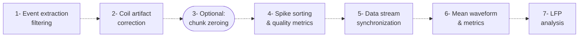

# EphysUtils
**Work in progress.**

Pipeline to preprocess extracellular electrophysiology Neuropixels data acquired using SpikeGLX. 

### Notes about this pipeline:
- Works with the suite of SpikeGLX tools i.e. **CatGT**, **TPrime**, etc. : https://billkarsh.github.io/SpikeGLX/
- Borrows/adapts some code in the SpikeGLX-adapted fork of the Allen's ecephys pipeline: https://github.com/jenniferColonell/ecephys_spike_sorting (e.g. mean waveform calculation)
- Written for Kilosort spike sorting (KS2 mostly):  https://github.com/MouseLand/Kilosort?tab=readme-ov-file (this is doc for KS4 / KS2 doc in related paper)
- Includes semi-automated curation using Bombcell: https://github.com/Julie-Fabre/bombcell

### Overview of the pipeline

### Summary of the main steps
- **Events extraction (CatGT)**: extracts times of TTL pulses acquired with the NI card in the `nidq.bin` output file of SpikeGLX
- **Filtering (CatGT)**: common median referencing by default
- **Coil artifact correction (TPrime)**:
  1. synchronize extracted coil/whisker stimulation times to each IMEC probe base time
  2. at each artifact time, replace duration of artifact (3ms default) by mean voltage just before, for all channels
  3. create copy of .ap/.meta file with the "corrected" suffix 
- **Chunk zeroing (OverStrike)**: zero-out entire chunks of data in the recordings when there is unsalvageable noise
- **Spike sorting (Kilosort)**: spike sorting algorithm for neuron identification, calls Kilosort 2.0 from the Python MATLAB engine (see below)
- **Quality metrics**: runs quality metrics pipeline from **Bombcell** (CortexLab) from the MATLAB engine, with by modified default:
  - Plotting is set to off (one plot/cluster generated), set to True for initial debugging/inspection
  - Further splitting of non-somatic to mua/good is set False
  - Computations of drift estimation/ephys properties is set to False (not immediately necessary)
- **Data stream synchronization (TPrime)**: synchronizes task event times (e.g. trial starts) and spikes times to the same time from a reference stream (default is the first IMEC probe clock)
- **Mean waveform estimation (C_Waves)**: efficient parsing of raw recordings to extract single spike waveforms to compute mean waveforms for each cluster
- **Mean waveform metrics**: code that calculates waveform metrics like peak-to-trough duration, etc. (note, bombcell looks at _template_ waveforms for peaks/troughs, but can also get raw mean waveforms and metrics)
- **LFP analysis**: performs depth estimation on LFP data

### Installation
#### Setting up
- You must have a GPU for spike sorting
- You must have installed Kilosort e.g. Kilosort2.0 (with correct MATLAB version e.g. R2021b)
- You must have installed CatGT, TPrime, C_Waves and OverStrike
- You must have cloned [npy-matlab](https://github.com/kwikteam/npy-matlab) and [bombcell](https://github.com/Julie-Fabre/bombcell) e.g. in `users/Github/`

#### Environments
1. Install the provided `ephys_utils` **conda environment**:
- `conda env create -f environment.yml` or `conda create --name ephys_utils --file requirements.txt`
  
2. Install **MATLAB** e.g. R2021b - specify the MATLAB version to use when calling the **MATLAB engine** in Python:
  - In MATLAB command window, type `matlabroot` to get root path
  - In terminal, go to `<matlabroot>\extern\engines\pyton`, then type `python setup.py install`
  - If the previous did not work, try: https://ch.mathworks.com/matlabcentral/answers/1998578-invalid-version-r2021-when-installing-for-python-3-7-3-9.
    That is, first run: `python -m pip install --upgrade setuptools`
  - Example for R2021b, run `python -m pip install matlabengine==9.11.21`
  - **Note**: if you can't run the matlab engine to run kilosort, run kilosort separately in MATLAB directly. Then continue with the steps of this pipeline.

3. Copy the file `run_main_kilosort.m` from this repo to the repo where you have installed **Kilosort2**, and update in that file:
- path to kilosort folder
- path to `npy-matlab`
- path to config files
  

4. Install a separate conda environment for **Phy**, `phy2`:
- Follow the instructions: https://github.com/cortex-lab/phy/
- This environment is used here to open Phy and save its output .tsv files

  
### Usage
The pipeline is separated into two main scripts:
1. `preprocess_spikesort.py`: performs Steps 1-2-3-4 -> specify raw data input folder path in lab server `data/`
2. optionally, inspect spike sorting and curation results using Phy and Phy's environment
3. `preprocess_sync.py`: performs Steps 5-6-7 -> specify processed data input folder path in lab server `analysis/FirstName_LastName/data`

The output of this pipeline can then be used to create NWB files using the [NWB_converter](https://github.com/LSENS-BMI-EPFL/NWB_converter) in particular the `ephys_to_nwb.py` converter.

### Possible future improvements (and ideas):
- Adaptation/robustness for Neuropixels 2.0 probes specifications and metadata (although most tools do take care of different metadata files) 
- Kilosort 4.0 called from python directly (if performance judged satisfactory)
- Integration of [SpikeInterface](https://github.com/SpikeInterface) tool(s)
- More LFP analyses...?
-  etc.

  
