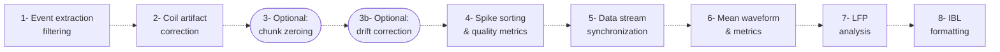

# EphysUtils

Pipeline to preprocess extracellular electrophysiology Neuropixels data acquired using SpikeGLX. 🐁🔌

### Notes about this pipeline ♻️
- Works with the suite of SpikeGLX tools i.e. **CatGT**, **TPrime**, etc. : https://billkarsh.github.io/SpikeGLX/
- Borrows/adapts some code in the SpikeGLX-adapted fork of the Allen's ecephys pipeline: https://github.com/jenniferColonell/ecephys_spike_sorting (e.g. mean waveform calculation)
- Uses spikeinterface, and should be compatible with every spikeinterface-compatible spike sorters https://spikeinterface.readthedocs.io/.
- Includes semi-automated curation using Bombcell: https://github.com/Julie-Fabre/bombcell, with KS2-adapted parameters.

### Overview of the pipeline :bookmark_tabs:	

```mermaid
graph LR
    Step1["1- Event extraction <br/> filtering"] -.-> Step2["2- Coil artifact <br/> correction"]
    Step2 -.-> Step3(["3- Optional: <br/> chunk zeroing"])
    Step3 -.-> Step3b(["3b- Optional: <br/> drift correction"])
    Step3b -.-> Step4["4- Spike sorting <br/> & quality metrics"]
    Step4 -.-> Step5["5- Data stream <br/> synchronization"]
    Step5 -.-> Step6["6- Mean waveform <br/> & metrics"]
    Step6 -.-> Step7["7- LFP <br/> analysis"]
    Step7 -.-> Step8["8- IBL <br/> formatting"]
```


### Summary of the main steps 
- **Events extraction (CatGT)**: extracts times of TTL pulses acquired with the NI card in the `nidq.bin` output file of SpikeGLX
- **Filtering (CatGT)**: common median referencing by default
- **Coil artifact correction (TPrime + SpikeInterface)**:
  1. synchronize extracted coil/whisker stimulation times to each IMEC probe base time (TPrime)
  2. at each artifact time, replace duration of artifact (3ms default) by interpolation (linear by default) using SpikeInterface's `remove_artifacts()`
- **Chunk zeroing (OverStrike)**: zero-out entire chunks of data in the recordings when there is unsalvageable noise
- **Drift correction (SpikeInterface, optional)**: motion correction before spike sorting using SpikeInterface's `correct_motion()` (e.g. with `kilosort_like` preset)
- **Spike sorting (SpikeInterface)**: spike sorting via SpikeInterface, compatible with multiple sorters (e.g. Kilosort4); MATLAB-based sorters (KS1/2/2.5/3) should also work but have not been thoroughly tested
- **Quality metrics**: runs quality metrics pipeline from **Bombcell** (CortexLab) as a Python package, with modified defaults:
  - Plotting is set to off (one plot/cluster generated), set to True for initial debugging/inspection
  - Further splitting of non-somatic to mua/good is set False
  - Computations of drift estimation/ephys properties is set to False (not immediately necessary)
- **Data stream synchronization (TPrime)**: synchronizes task event times (e.g. trial starts) and spikes times to the same time from a reference stream (default is the first IMEC probe clock)
- **Mean waveform estimation (C_Waves)**: efficient parsing of raw recordings to extract single spike waveforms to compute mean waveforms for each cluster
- **Mean waveform metrics**: code that calculates waveform metrics like peak-to-trough duration, etc. (note, bombcell looks at _template_ waveforms for peaks/troughs, but can also get raw mean waveforms and metrics)
- **LFP analysis**: performs depth estimation on LFP data
- **IBL-data formatting**: performs additional formatting of data for IBL apps (e.g. [atlaselectrophysiology](https://github.com/int-brain-lab/iblapps/tree/master/atlaselectrophysiology) for ephys-histology alignment)

**Execution time ⏱️:** for a recording of ~1h with 4 probes inserted deep (~3mm) and saving the entire default bank 0, the entire pipeline take about 12-24 hours on a local machine. This is very dependent on the recordings itself. Spike sorting, CatGT and C_waves take the longest time.
 
### Installation 🖥️
#### Setting up
- You must have a GPU for spike sorting
- You must have installed CatGT, TPrime, C_Waves and OverStrike (these are bundled in the Docker image — no manual install needed if running containerized)

#### Environments
1. Install the package in a specific environment:
  - With uv (preferred): `uv sync`
  - With pip in a virtual environment: `pip install -e .`

This includes **Kilosort4** as a dependency (pure Python, no MATLAB needed).

##### For other Python-based sorters
For instructions on installing other SpikeInterface-compatible sorters, see: https://spikeinterface.readthedocs.io/en/stable/get_started/install_sorters.html

##### For Matlab based kilosort (<4.0)
**Note**: MATLAB-based sorters (KS2/2.5/3) have not been thoroughly tested on this branch but should work. SpikeInterface handles all I/O so `npy-matlab` is not required. MATLAB itself must be installed (compatible with kilosort version and your CUDA version), unless running containerized (SpikeInterface's containerized sorters can run MATLAB-based sorters without a MATLAB license).

2. Clone the Kilosort version you want to use (https://github.com/MouseLand/Kilosort) and set the path via SpikeInterface:
```python
si.KilosortSorter.set_kilosort_path('/path/to/Kilosort')
```

3. Install **Phy**, (optional, for data visualization):
- Follow the instructions: https://github.com/cortex-lab/phy/
  
### Usage ⚡ 
The pipeline is separated into two main scripts, called with a path list and a config file:
1. `preprocess_spikesort_si.py`: performs Steps 1-2-3-4 -> specify raw data input folder path(s) in `config/inputs.txt`
   ```
   python preprocess_spikesort_si.py --input-list config/inputs.txt --config config/preprocess_config_si.yaml
   ```
2. optionally, inspect spike sorting and curation results using Phy:
    - `phy template-gui params.py` in the Kilosort output folder (**note**: edit `params.py` to point to the .ap.bin file if you want to see TraceView or single waveforms)
3. `preprocess_sync_si.py`: performs Steps 5-6-7 -> specify processed data input folder path in lab server `analysis/FirstName_LastName/data`
   ```
   python preprocess_sync_si.py --input-list config/inputs.txt --config config/preprocess_config_si.yaml
   ```
4. `run_ibl_ephys_atlas.py`: (optional) performs Step 8, formatting of the ephys SpikeGLX/KS data into IBL-compatible format, to be used by the [atlaselectrophysiology IBL app](https://github.com/int-brain-lab/iblapps/tree/master/atlaselectrophysiology) for alignment of ephys features with histology.

#### Docker
The pipeline can be run containerized using Docker Compose, with two services:
- `ephys-spikesort`: GPU-enabled spike sorting (Steps 1-4)
- `ephys-sync`: CPU-only sync/waveform processing (Steps 5-7)

```
docker compose run ephys-spikesort
docker compose run ephys-sync
```

#### HPC (Singularity/SLURM)
For HPC clusters, the Docker image can be converted to a Singularity `.sif` and submitted via SLURM. Four scripts are provided in `singularity/`:
- `slurm_spikesort.sh` / `slurm_sync.sh`: single-job mode (one session)
- `slurm_spikesort_array.sh` / `slurm_sync_array.sh`: job array mode (parallel across sessions)

The output of this pipeline can then be used to create NWB files using the [NWB_converter](https://github.com/LSENS-BMI-EPFL/NWB_converter) in particular the `ephys_to_nwb.py` converter.

### How to contribute ✨
1. Let's discuss changes/fixes
2. Make a branch, implement changes
3. Make a pull request and ask a user to review it!
4. Merge & inform other users 🙂

### Possible future improvements (and ideas) 🗻
- Adaptation/robustness for Neuropixels 2.0 probes specifications and metadata (although most tools do take care of different metadata files) 
- More LFP analyses...?
-  etc.

  
